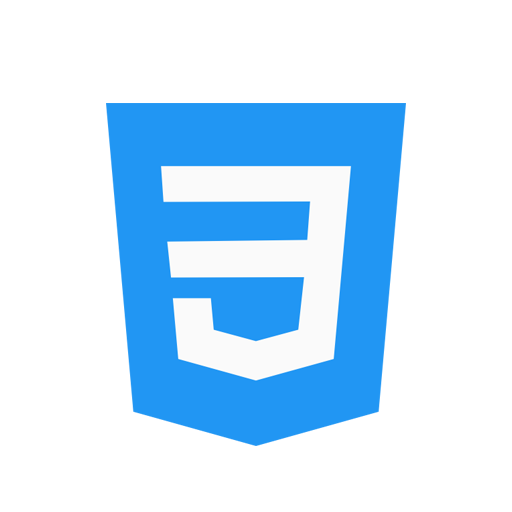
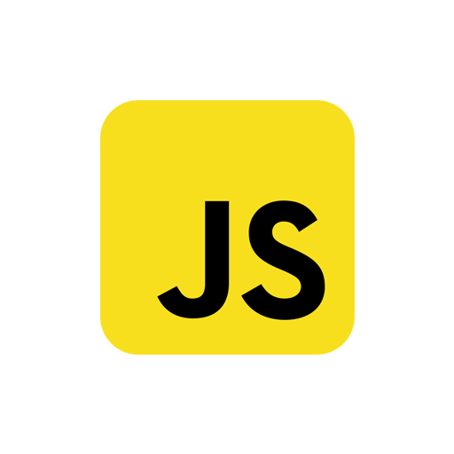
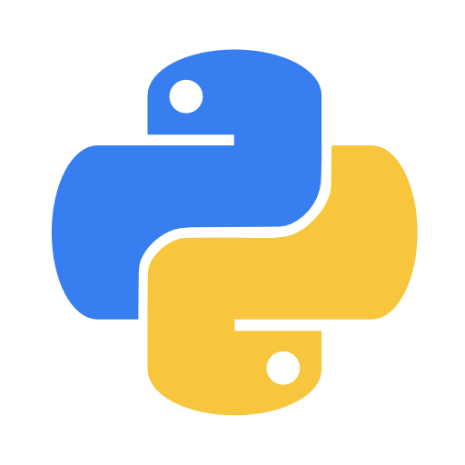
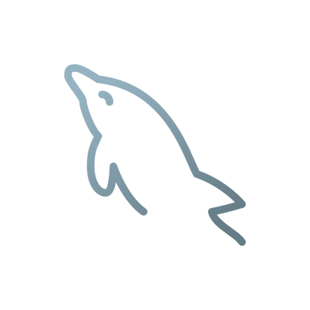
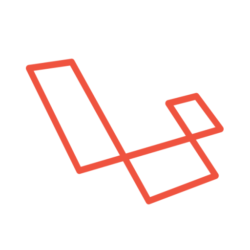
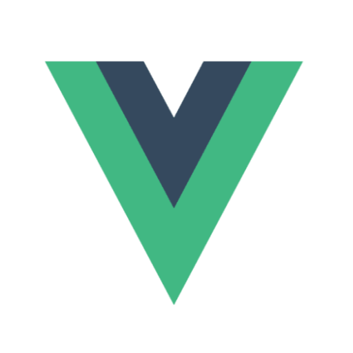
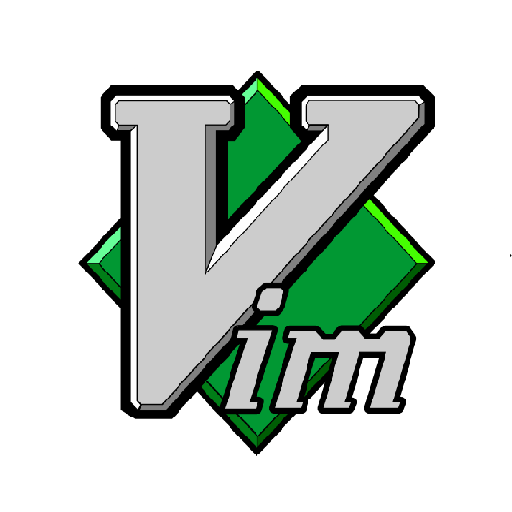
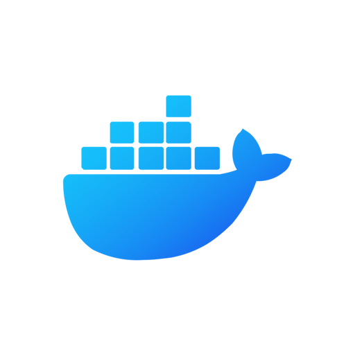

### Jazib Khan 👋
---

	
#### About Me

Strong passion in programming and software development. I've achieved a bachelor's degree in Computing and have immersed myself in software development. 

I have experience as a backend developer working with MVC frameworks following OOP practises as well as frontend mobile app and web development.

#### I can code in...

	
	
	
	
	
	
	

#### I can use...

	
	
	
	
	
	
	
	
	

<!--
**Jazib-Khan/Jazib-Khan** is a ✨ _special_ ✨ repository because its `README.md` (this file) appears on your GitHub profile.

Here are some ideas to get you started:

- 🔭 I’m currently working on ...
- 🌱 I’m currently learning ...
- 👯 I’m looking to collaborate on ...
- 🤔 I’m looking for help with ...
- 💬 Ask me about ...
- 📫 How to reach me: ...
- 😄 Pronouns: ...
- ⚡ Fun fact: ...
-->
